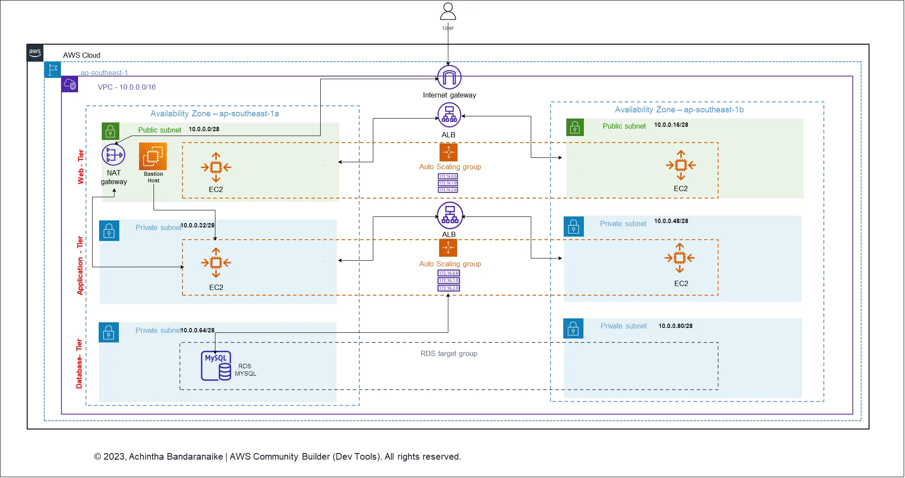

# Three-Tier Architecture with Terraform on AWS

This guide provides detailed instructions on how to set up a three-tier architecture on AWS using Terraform. It covers cloning the repository, setting up AWS credentials, creating an EC2 key, and running Terraform commands to deploy the architecture.


## What is a Three-Tier Architecture?

A three-tier architecture is a client-server software architecture pattern that includes three layers:

1. **Presentation Tier**: The topmost layer, where the user interface resides. This is the client-facing part of the application, typically a web or mobile application.
  
2. **Application Tier**: The middle layer, which contains the business logic of the application. This is where data is processed, and application logic is executed. It may include services, APIs, and business rules.
  
3. **Data Tier**: The bottom layer, where data storage and retrieval occur. This is where the application's data is stored in databases or other storage systems.

This architecture helps separate concerns, promotes scalability, and enhances maintainability.

## Prerequisites

- **AWS Account**: You will need an AWS account to deploy the architecture.
- **Terraform**: Make sure you have Terraform installed on your machine. You can download it from [Terraform's official website](https://www.terraform.io/downloads.html).
- **AWS CLI**: Install and configure AWS CLI for setting up AWS credentials. You can download it from [AWS CLI website](https://aws.amazon.com/cli/).
  
## Clone This Repo

To start, clone this repository to your local machine using the following command:

```shell
git clone https://github.com/nakulgrover18/3tierarchitecture.git
cd 3tierarchitecture
```

## Set Up AWS Credentials

Make sure your AWS credentials are set up properly. This can be done by configuring AWS CLI:

```shell
aws configure
```

You will be prompted to enter your AWS Access Key ID, Secret Access Key, region, and output format.

## Create EC2 Key

Create an EC2 key in your preferred AWS region with the name `three-tier-key`. You can create the key using the AWS Management Console or using the AWS CLI:

### Using AWS Management Console

1. Navigate to the EC2 dashboard in your AWS Management Console.
2. Go to "Key Pairs" under the "Network & Security" section.
3. Click on "Create Key Pair" and name it `three-tier-key`.
4. Save the key file (`.pem` file) in a secure location.

### Using AWS CLI

```shell
aws ec2 create-key-pair --key-name three-tier-key --query 'KeyMaterial' --output text > three-tier-key.pem
```

Remember to set the correct permissions on the key file:

```shell
chmod 400 three-tier-key.pem
```
## Terraform Configuration Files

The repository contains four Terraform configuration files:

1. **`database.tf`**: This file defines the configuration for creating an RDS (Relational Database Service) instance.

2. **`ec2.tf`**: This file defines the configuration for creating EC2 instances for the application and presentation layers.

3. **`network.tf`**: This file contains the configurations for all network components, including VPCs and other networking resources.

4. **`variables.tf`**: This file defines the input variables used across the other Terraform files.

## Deploying the Infrastructure with Terraform

1. **Initialize Terraform**: First, initialize the Terraform project to download the required providers and initialize the project.

    ```shell
    terraform init
    ```

2. **Plan**: Run the plan command to see what changes Terraform will make to your infrastructure.

    ```shell
    terraform plan
    ```

3. **Apply**: Once you're satisfied with the plan, apply the changes to create the infrastructure.

    ```shell
    terraform apply
    ```
